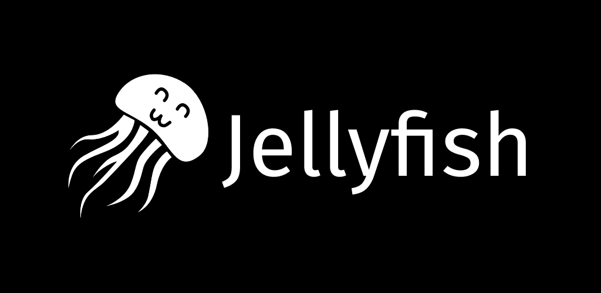

<p align="center">
  
</p>

<p align="center">
  <strong>A modern, cross-platform Jellyfin + Jellyseerr client built with Flutter.</strong>
</p>

<p align="center">
  <a href="#"></a>
  <a href="#"></a>
  <a href="#"></a>
  <a href="#"></a>
</p>

---

## About

**Jellyfish** is a cross-platform client for [Jellyfin](https://jellyfin.org) with native integration of [Jellyseerr](https://docs.jellyseerr.dev) for content requests. Designed to deliver a smooth, polished and complete experience on mobile, tablet, desktop and web.

> [!IMPORTANT]
> **The [Jellyfish Bridge](https://github.com/Jellyfish-Client/plugin) Jellyfin server plugin is required for full functionality.**
> Jellyfish does **not** talk directly to Jellyseerr / Radarr / Sonarr — every call is proxied server-side by the Bridge plugin behind your Jellyfin auth.
> Without it the app still works as a pure Jellyfin client, but you'll lose: Jellyseerr requests, the "Other titles" rails on details pages, the actor / person filmography augmented with TMDB credits, missing-season pickers, search results from outside the library, and the admin Radarr / Sonarr views.
> Install it on your Jellyfin server from the [Jellyfish-Client repository](https://github.com/Jellyfish-Client/plugin#install-on-jellyfin) (one-click via the plugin catalog).

## Features

### Playback & media
- **Native, performant player** powered by `media_kit` (mpv) with multi-track audio / subtitle support
- **Chromecast** support targeting the official Jellyfin receiver: device discovery, mini-player, full Now Playing screen, audio/subtitle switching from the receiver tracks
- **Picture-in-Picture** automatic on iOS / Android
- **MediaSession** integration: lock-screen controls, Bluetooth headsets, CarPlay / Android Auto
- **Auto-skip** intro / outro via Jellyfin Media Segments
- **Subtitle offset**, audio sync, gesture-based brightness & volume
- **Background playback** and smart **resume**

### Library & discovery
- Modular **Home** view: Continue Watching, Next Up, Recent, Favorites, Hidden Gems & custom rails
- **Relevance-ranked search** (movies & series prioritized, seasons/episodes excluded)
- **Rich details**: cast, recommendations, streaming providers, ratings
- **Calendar** of upcoming releases
- **Favorites**, watched / unwatched marking with multi-client sync

### Downloads & offline mode
- **Background downloads** (`background_downloader`)
- Local **Drift database** for metadata, sync queue and playback state
- **Full offline mode**: browse, play and mark items offline, queue replay on reconnection

### Jellyseerr integration *(requires the [Bridge plugin](https://github.com/Jellyfish-Client/plugin))*
- Request movies & series from within the app
- Track **requests** and their status
- Actor / person pages augmented with TMDB filmography
- **Admin** dashboard to manage requests (10 admin modules)

### Multi-account
- Manage multiple servers and users
- Fast switching between accounts
- Secure storage via `flutter_secure_storage` (Keychain / Keystore)

## Tech stack

| Area | Tooling |
|---|---|
| **UI** | Flutter 3.32+, Material 3, `google_fonts` |
| **State** | Riverpod 2 (manual pattern, no Riverpod codegen) |
| **Routing** | `go_router` |
| **Networking** | `dio`, generated Jellyfin & Jellyseerr SDKs (OpenAPI) |
| **Storage** | `drift` (SQLite), `flutter_secure_storage`, `shared_preferences` |
| **Media** | `media_kit`, `audio_service`, `floating` (PiP), `wakelock_plus` |
| **Downloads** | `background_downloader`, `workmanager` |
| **Notifications** | `flutter_local_notifications`, `timezone` |
| **Lints** | `very_good_analysis` (strict) |

## Architecture

```
lib/
├── app/              # Bootstrap, theme, routes
├── core/             # Cross-cutting layers
│   ├── jellyfin/     # Jellyfin client + SDK wrappers
│   ├── seerr/        # Jellyseerr client
│   ├── downloads/    # Download engine + Drift
│   ├── sync/         # Offline → online sync queue
│   ├── playback/     # Player backend, preferences
│   ├── auth/         # Sessions, accounts, secure storage
│   └── ...           # cache, network, platform, storage, etc.
├── features/         # Screens grouped by domain
│   ├── home/         library/    search/      details/
│   ├── player/       downloads/  requests/    admin/
│   ├── settings/     accounts/   calendar/    onboarding/
│   └── watch_provider/
├── shared/           # Shared widgets (cards, sheets, etc.)
└── l10n/             # Localization
```

## Getting started

### Prerequisites
- Flutter **3.32+** and Dart **3.11+**
- Xcode 15+ (iOS / macOS), Android Studio (Android), CMake (Linux/Windows)
- A reachable **Jellyfin** server with the **[Jellyfish Bridge plugin](https://github.com/Jellyfish-Client/plugin)** installed — required for Jellyseerr / Radarr / Sonarr features (the app falls back to Jellyfin-only mode without it)
- *(Optional)* a **Jellyseerr** instance reachable from the Jellyfin host so the Bridge can proxy requests to it

### Installation

```bash
# 1. Clone
git clone https://github.com/<your-user>/jellyfish.git
cd jellyfish

# 2. Dependencies
flutter pub get

# 3. Codegen (Drift, Freezed, json_serializable)
dart run build_runner build --delete-conflicting-outputs

# 4. Run
flutter run
```

### Generate icons & splash

```bash
dart run flutter_launcher_icons
dart run flutter_native_splash:create
```

## Supported platforms

| Platform | Status |
|---|---|
| Android | Supported |
| iOS | Supported |
| macOS | Supported |
| Windows | Supported |
| Linux | Supported |
| Web | Experimental |

## Tests & quality

```bash
flutter analyze                  # Strict lint (very_good_analysis)
flutter test                     # Unit & widget tests
flutter test integration_test/   # Integration tests
```

## Roadmap

See [`V1_PLAN.md`](./V1_PLAN.md) for the detailed v1 plan.

## License

This project is an unofficial third-party client. Jellyfin and Jellyseerr are independent projects under their own licenses.

---

<p align="center">
  Built with <code>flutter</code> and a lot of coffee ☕
</p>
